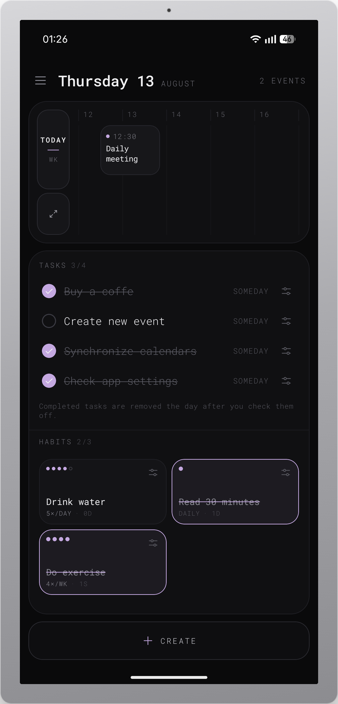
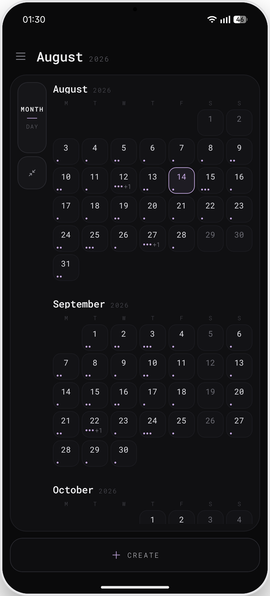
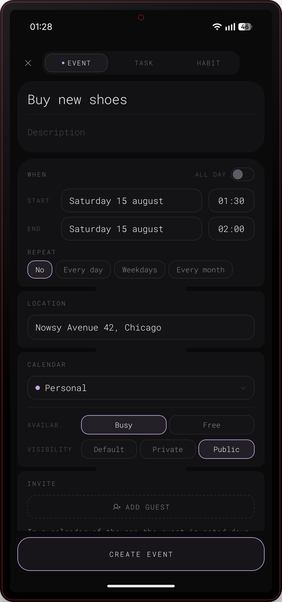
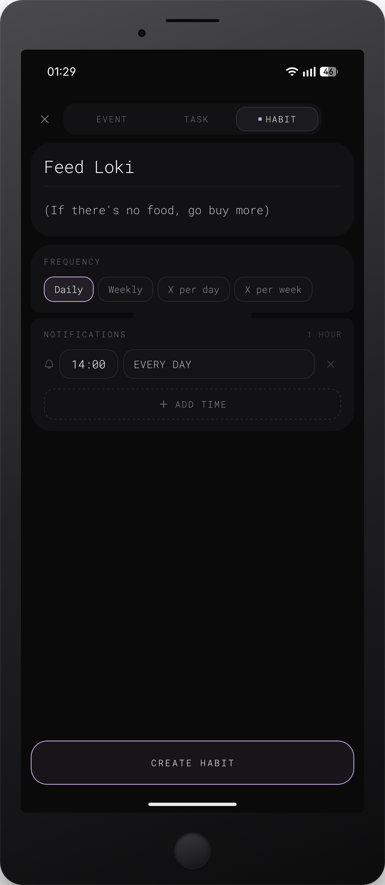
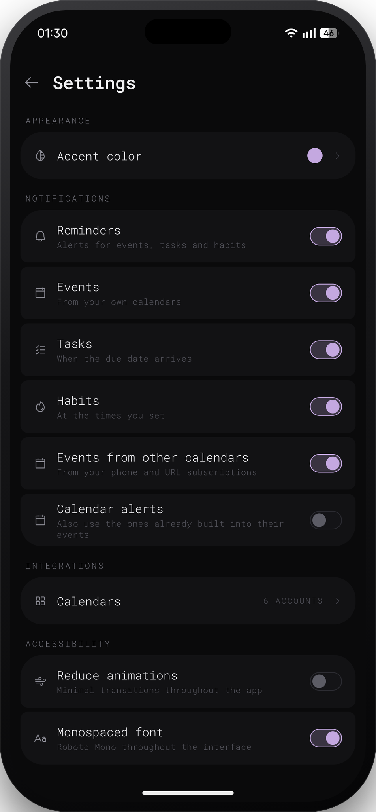
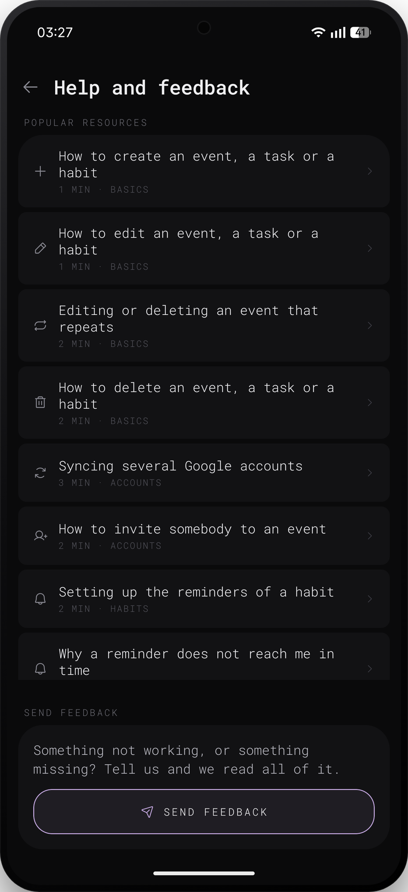

<div align="center">

# D-Calendar

**Calendar, tasks and habits on a single screen.**
No account. No server. No tracking.

[](https://github.com/raamonsiu/d-calendar/releases/latest)
[](https://buymeacoffee.com/d1ito)

[](LICENSE)
[](https://reactnative.dev)
[](https://expo.dev)
[](https://www.typescriptlang.org)
[](https://github.com/raamonsiu/d-calendar/releases/latest)
[](https://github.com/raamonsiu/d-calendar/actions/workflows/ci.yml)
[](https://github.com/raamonsiu/d-calendar/releases)

</div>

---

## About D-Calendar

D-Calendar puts your month, your tasks and your habits on one screen, and then
gets out of the way.

It reads the calendars your phone already syncs (Google, Outlook, iCloud)
through the operating system itself, so there is no account to create, no OAuth
screen and no password for this app to hold. Events you own can be edited and
deleted; new ones can be created in any calendar the system lets it write to.
Calendars published as `.ics` can be subscribed to by URL and are kept for
offline reading.

Tasks and habits are the app's own, stored on the device. Reminders are real
local notifications, scheduled by the operating system and fired with the app
closed.

The interface ships in **Spanish, English and Catalan**, picked up from the
device language at first launch and changeable in Settings.

> **Alpha 1.1.** The app is complete and usable, but this is still an early
> public build. Expect rough edges, and please
> [open an issue](https://github.com/raamonsiu/d-calendar/issues/new) when you
> find one.

---

## Mockups

<div align="center">
  
  
  
  
  
  
</div>

---

## Features

### Calendar

- **Four views on one screen** - today, the week, the expanded day and the
  expanded month, switched without leaving Home.
- **The calendars your phone already has** - read through `expo-calendar`, so
  Google, Outlook and iCloud arrive with no OAuth of the app's own.
- **Real editing** - events you own can be edited, moved and deleted. A
  repeating event asks first whether the change is for that day or the whole
  series.
- **Guests** - an event created in a device calendar that accepts attendees is
  written with them, and the account it belongs to mails the invitation.
- **Subscribe by URL** - any published `.ics` (a timetable, a holiday calendar,
  a Google secret address) is downloaded, parsed with time zones and recurrence
  rules, and kept on the device so it is still there with no signal.

### Tasks and habits

- **Tasks** with an exact due date, an approximate month, or no date at all.
- **Habits** counted daily, weekly, or N times per day or week, with streaks.
- **Completed tasks clean themselves up** the day after you check them off, so
  the list never turns into an archive.
- **A habit starts over** when its day or week ends, and the streak survives
  only when the period before it was completed.

### Home screen widget

- **One habit on the home screen**, picked when you add the widget and changed
  by holding it.
- **Tap to count a repetition** without opening the app. It follows the same
  rules as the card: the same period, the same streak.
- **It looks like the app** - your accent colour, and the completed habit
  crossed out the way the card does it.
- Android only. Widgets are native by nature, and the iOS half needs a
  different toolchain.

### Reminders

- **Local notifications**, scheduled by the operating system, fired with the app
  closed. No server is involved at any point.
- **Per-category switches** - events, tasks, habits and events from other
  calendars can each be turned off on their own.
- **Alarms inherited** from device calendars are off by default, because the
  calendar they came from already announces them.

### Interface

- **Three languages** - Spanish, English and Catalan.
- **Six accent colours**, a monospaced-font mode and a reduce-animations mode
  that also follows the system accessibility setting.
- **Dark by design** - one dark theme, built around surfaces rather than
  shadows.

---

## Android Set Up

### Install the APK

1. Download the latest APK from
   [Releases](https://github.com/raamonsiu/d-calendar/releases/latest).
2. Open it on your phone. Android will ask you to allow installing from this
   source - that is expected for any app outside the Play Store.
3. On first launch the app asks for two permissions. Both are optional and the
   app works without them:
   - **Calendar** - to read and write the calendars your phone already syncs.
     Without it, only the app's own events are shown.
   - **Notifications** - to fire reminders. Without it, nothing is scheduled.

Permissions are only ever requested when you tap them in the onboarding or in
Settings. If you deny one, tapping the row again opens the system settings,
which is the only place Android lets that decision be changed.

### Build from source

Requires Node.js 20+, the Android SDK, and a JDK 17.

```bash
npm install
```

```bash
npx expo run:android
```

That builds a debug APK and installs it on a connected device or a running
emulator. The design is laid out for 412×892, so Android is the reference. The
home screen widget needs this native build: it does not exist in Expo Go.

For a release build you need your own signing keystore - the one used for the
published releases is not in this repository, and it cannot be:

```bash
npx expo prebuild --platform android --clean
```

```bash
cd android && ./gradlew assembleRelease
```

The APK lands in `android/app/build/outputs/apk/release/`.

### Development commands

```bash
npx expo start
```

```bash
npm test
```

```bash
npm run typecheck
```

```bash
npm run lint
```

---

## Contributing

Pull requests are welcome. The short version:

- `npm test` and `npm run typecheck` must pass locally before you open a PR.
- Follow the conventions already in the code: JSDoc where it earns its place,
  descriptive names, no dead code.
- Keep PRs small enough to review in one sitting.
- Fill in the pull request template - a workflow checks the sections are there.

The long version is in [CONTRIBUTING.md](CONTRIBUTING.md).

**Found a bug?**
[Open an issue](https://github.com/raamonsiu/d-calendar/issues/new) with what
you did, what you expected and what happened instead. Your Android version and
the app version (Settings › About) help a lot.

---

## Privacy data

**D-Calendar has no backend.** There is no account, no analytics, no crash
reporting and no telemetry of any kind. Nothing about you is collected, and
nothing is sent anywhere for the app's own purposes.

What the app stores, it stores on your device:

| Data | Where it lives | Leaves the device? |
|---|---|---|
| Tasks, habits, preferences | Device storage (AsyncStorage) | Never |
| Events you create in an app calendar | Device storage | Never |
| Events you create in a device calendar | The system calendar database | Yes - synced by that account (Google, Outlook…), exactly as if you had used the phone's own calendar app |
| Subscribed `.ics` calendars | Downloaded from the URL you provide | The URL is requested from your device; nothing is sent with it |
| Reminders | The operating system's notification queue | Never |

Two things reach the network, both only when you ask for them:

- **Subscribed calendars** - the `.ics` URL you entered is downloaded.
- **Feedback** - if you use "Send feedback" in Help, the message you typed is
  relayed by [EmailJS](https://www.emailjs.com) to the developer's inbox. Only
  what you wrote is sent.

The full text lives in the app under Settings › Legal, and in
`src/data/legal.ts`.

---

## License

D-Calendar is released under the [MIT License](LICENSE).

In short: you may use, copy, modify and redistribute this code, including
commercially, as long as the copyright notice and the licence text travel with
it. It comes with no warranty of any kind.

The libraries the app is built on keep their own licences, all of them
permissive (MIT, Apache-2.0, BSD). The full list, with links, is in the app
under Settings › About › Open source licences, and in `src/data/licenses.ts`.

The designs and the icon are part of this repository and covered by the same
licence.

---

<div align="center">

Made with love by **D1ITO**

[](https://github.com/raamonsiu)
[](https://buymeacoffee.com/d1ito)

If D-Calendar is useful to you, a coffee is the whole business model.

</div>
